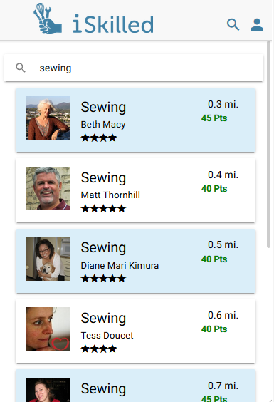
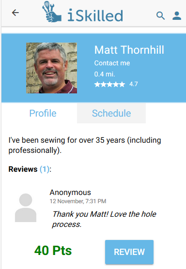

# I-Skilled
I-Skilled is a hybrid mobile application prototype that facilitates a platform where users learn and teach various skills to others in their community, ranging from how to change a car's oil to languages. Developed in Ionic/Angular, using Firebase cloud storage, I-Skilled can run on most smartphones.




## DEPENDENCIES 
1. Firebase Realtime Database:
Instructions can be found on Google Firebase Console docs, at https://firebase.google.com/docs/database/web/start
2. Node/Npm: 
Instructions can be found on npmJS docs, at https://docs.npmjs.com/getting-started/installing-node

## INSTALLATION & CONFIGURATION
Install Ionic
```
npm install -g cordova ionic
```
Clone this repo. Within the cloned project directory, run the following to install all dependencies
```
npm install
```
Create the file app.firebaseEnv.ts in your local src/app directory, containing your Firebase API configuration, similar to:
```
export const firebaseConfig = {
 apiKey: "",
 authDomain: "",
 databaseURL: "",
 projectId: "",
 storageBucket: "",
 messagingSenderId: ""
}
```

## BUILD & DEPLOY
### In the browser
```
ionic serve
```
The default hostname is localhost. The default port is 8100.

### On an Android phone
1. First time cordova setup
```
 ionic cordova platform add android
```
2. Connect your phone via USB
3. Run to launch on device
```
 ionic cordova run android --device
```

### On an iOS phone
1. install Xcode 
2. go into your local project directory, and run a production build of your app
```
ionic cordova platform add ios
ionic cordova build ios
```
3. Open the .xcodeproj file in platforms/ios/ in Xcode
4. Connect your phone via USB and select it as the run target
5. Click the play button in Xcode to try to run your app

### Using Ionic View
Make an account on Ionic at http://ionicframework.com/ , and create an app
1. Install the latest Ionic CLI
```
npm install ionic@latest
```
2. Connect your app to the Ionic website
```
ionic start --pro-id [####] 
cd [Your_App_Name]
```
3. Push your code to the Ionic Website Dashboard
```
git push ionic master
```
4. Add your own external repository as the default origin
```
git remote add origin [Your_repository_URL]
git push --set-upstream origin master
```
To test your app or have other users test your app on a phone, download 'Ionic View-Test Ionic Apps' from the app store.
Provide other users with the public id assigned on your ionic website dashboard to view the app. 

## PLATFORM CONSTRAINTS
Ionic lacks certain native app abilities but accomodates most of them using ionic cordova plugins.

## BUGS
- header bar overlaps on some phones
- pictures may be slow to load from database
- search bar does not cover entire width of screen

## TODO
- Managing requested lessons for giver and receiver. 
- Reviewing a user after a lesson occurs
- Search based on proximity to user and other fields
